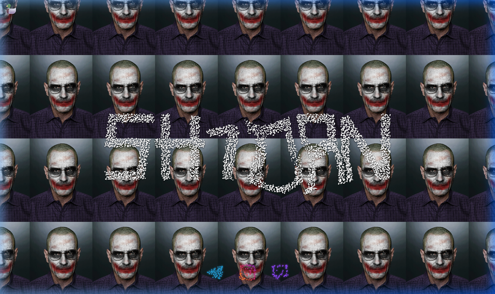

<div align="center">

# 🦆 yanriabonenko.xyz

**Interactive Canvas Particle Business Card**

<br/>

[](https://sh1dan.github.io/yanriabonenko.xyz/)
[](https://yanriabonenko.xyz)
[](LICENSE)

<br/>

[](https://t.me/yanriabonenko)
[](https://www.instagram.com/yanriabonenko)
[](https://www.twitch.tv/sh1dan)

<br/><br/>



<br/><br/>

---

</div>

### 🎮 Highlights

- **Swarm Physics** — Particles get caught in the cursor's wake and chase after your mouse when moving over the nickname.
- **Particle Socials** — Official Telegram, Instagram, and Twitch vector logos rendered directly within the particle field with hover tooltips and click links.
- **BigShot Mode 🦆** — Secret Easter egg activated by hovering or tapping the duck in the top-left corner, triggering high-tempo audio, visual transitions, and dancing particle waves.
- **Soundscapes** — Atmospheric ambient background audio with dynamic audio switching.
- **Responsive** — Optimized for both desktop and mobile devices with adaptive particle densities and DPI scaling.

<br/>

### 🛠 Built With

<p>
  
  
  
  
  
</p>

<br/>

### 🚀 Local Setup

Open `index.html` directly in your browser or run:

```bash
npx serve .
```

---

<div align="center">
  <sub>© 2026 <a href="https://github.com/sh1dan">sh1dan</a> • Released under the <a href="LICENSE">MIT License</a></sub>
</div>
